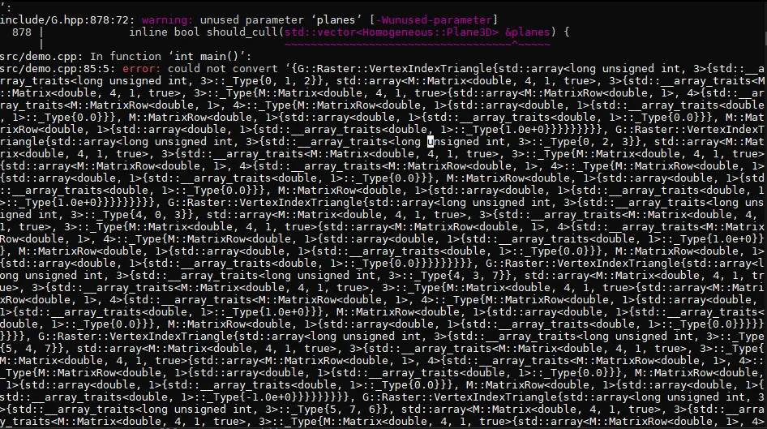

# Why Zinc? 🤔

This document describes the unique features, design motivation and "philosophy" of Zinc.

> 🐒 This document is entirely written by a human. It may make unnecessary appeals to emotion and lived experiences.

## Motivation

Zinc is a language based on a few core tenets I have found in my programming experience utilizing a variety of languages and paradigms. 

> 😮 Note that we use the word "*solved*" here in an intentionally controversial way. All of these problems still exist and the book is by no means closed. The point is to highlight how strongly we take these views as guiding design principles.

- **Rust solved safety + performance**
- **Go solved concurrency**
- **Python solved syntax**  

These are the *core* principles, but zinc also some opinionated features of its own that we will see below.x

## Typing

A core principle of Zinc is that we should not have to "design for the type system" but rather that the type system should provide detailed information to the user to enrich and enhance their designs.

In order to have a detailed discussion about types in Zinc, there are 3
concepts that we have to establish so that we can have this discussion at an intelligent level. We need to understand how zinc handles **gradual typing**, **monomorphization**, and **structs**.

### Gradual Typing

Zinc is a [**gradually-typed**](https://en.wikipedia.org/wiki/Gradual_typing) language. This means
that like python you do not have to provide types for you variables. ***Unlike*** python, if you do provide a type then that type is strictly enforced.

For example, consider the following python code

```python
class Temps:
    def __init__(self, x: float, y: float):
        self.x = x
        self.y = y

class Items:
    def __init__(self, x: int, y: int):
        self.x = x
        self.y = y

def sum_counts(item: Temps) -> float:
    return item.x + item.y

print(sum_counts(BookCounts(1, 2)))

# Both the parameter and return type are wrong,
# but this works because python does not enforce types at all.
print(sum_counts(CatCounts(3,4)))
```

In python, the type annotation `item: BookCounts` is truly just a "hint". It doesn't matter at
all and it purely for aesthetic/documentation purposes. There are no shortage of third-party
libraries such as [`mypy`](http://mypy-lang.org/), [`pyre`](https://pyre-check.org/) and [`pyright`](https://github.com/microsoft/pyright), etc, which all attempt to add static type checking to python. However, these are all separate tools that are not part of the core language and they all have their own quirks and limitations. Most importantly, python achieved its great success **without** strict typing at all.

> 🗣️🙉 Rant incoming.

Types (besides floating points and integers) do not exist at the hardware level they are purely a human construct. Anyone who has spent lots of type in large strictly typed code bases such as Java or C++ has
inevitably ended up in situations where they are writing code purely just to satisfy the technicalities of the type system rather than providing actual value. All the way back in 1998 Peter Norvig demonstrated that 16 out of the 23 patterns in the ["Gang of Four Design Patterns"](https://en.wikipedia.org/wiki/Design_Patterns) are simplified or eliminated by dynamic typing. 

To get around type systems, we came up with generics and [template meta programming](https://en.wikipedia.org/wiki/Template_metaprogramming), which can lead to such fantastical compiler errors that are almost certainly in the Devil's coffee table book.



> source: https://www.reddit.com/r/programminghorror/comments/mm8put/me_fully_embracing_c_templates_but_making_a/

I take the position that this is poor design. If we are are mostly coming up with clever workarounds to satisfy the type system, then this is time spent not coming up with clever solutions to the ***actual*** problem.

While one might argue against this, I take an empirical approach: Look at the incredible success of python. Do we really **need** types to write good software? The evidence says no.

When taking a graduate compilers class, and actually writing a compiler a few things became very clear to me. 

- Type systems are great for **compilers**. Being able to safely reason about the types of variables and functions allows the compiler, and its author, to drastically simplify the already insanely hard problem of writing a compiler. Python itself is technically **strongly typed** but not **strictly typed**.

> 🤓 **Strongly typed** means that the language enforces type rules at ***runtime***, preventing operations on incompatible types.
> **Strictly typed** means that the language enforces type rules at ***compile time***, preventing operations on incompatible types before the program runs.

- The compiler already knows a great deal about the types of variables and functions. Of course it does. How else is it going to tell you the you passed in the wrong the type of argument to a function? 

Despite these issues, types do, in many cases, provide some value and safety. Particularly when authoring libraries for other developers to use.

So a good middle ground is the following:

> ***Types are optional, but if specified, they are enforced.***

In zinc, since we enforce the type, this would fail.

```rust
// zinc
fn sum_counts(item: Temps) -> f32 {
    return item.x + item.y
}

fn main() {
    print(sum_counts(Items { x: 3, y: 4 })) // ⛔️ ERROR: wrong type!
}
```

If you don't care what about the type of the `item` parameter, then you can just leave it out and it will work just fine.

```rust
// zinc
fn sum_counts(item) {
    return item.x + item.y
}

fn main() {
    print(sum_counts(Items { x: 3, y: 4 })) // ✅ This works!
    print(sum_counts(Temps { x: 3.14, y: 2.71 })) // ✅ This works too!
}
```

However, we compile to Rust. So how do we actually achieve this? We answer this in the next section.


### Monomorphization

Zinc uses [`monomorphization`](https://en.wikipedia.org/wiki/Monomorphization) to achieve gradual typing. (This is actually the same technique used by Rust to achieve zero-cost abstractions with its generics). "Mono" means "one" and "morph" means "form". "-ization" is just a suffix that means "the process of". So monomorphization is "the process of creating one form".

THe end result is fairly simple the following zinc code:

```rust
/// zinc
fn sum_counts(item) {
    return item.x + item.y
}

fn main() {
    sum_counts(Items { x: 3, y: 4 })
    sum_counts(Temps { x: 3.14, y: 2.71 })
}
```

Will be compiled to the following rust code:
```rust
/// zinc
fn sum_counts(item: Temps) -> f32 {
    return item.x + item.y
}

fn sum_counts(item: Items) -> i32 {
    return item.x + item.y
}

fn main() {
    sum_counts(Items { x: 3, y: 4 })
    sum_counts(Temps { x: 3.14, y: 2.71 })
}
```

While [monomorphization is fast](https://users.rust-lang.org/t/monorphization-vs-dynamic-dispatch/65593) it does lead to more generated
code. That means larger compiled binaries (and longer compile times). 
But in this day and age, who cares? Again taking an empirical stance,
the success of containers and their often multi-GB size for even
simple applications, shows that "binary size" doesn't matter at all in
non-embedded environments.

As we can see, typing and monomorphization are closely intertwined in
Zinc. We will have **much** more to say about typing in zinc. Before
we do we need to talk about how users define their own types in zinc
with **structs**.

### Structs

Structs are where Zinc diverges the most from languages rust and python.
Struct syntax in Zinc are highly inspired by python's [dataclasses](https://docs.python.org/3/library/dataclasses.html).

Lets provide a simple example of a simple `Point` struct in zinc, python and rust.

```python
class Point:
    def __init__(self, x: float, y: float):
        self.x = x
        self.y = y

    def norm(self) -> float:
        return (self.x ** 2 + self.y ** 2) ** 0.5

    @staticmethod
    def dimension() -> int:
        return 2

    @classmethod
    def from_tuple(cls, t: tuple[float, float]) -> Point:
        return cls(t[0], t[1])
```

In this class we have:

- two instance variables `x` and `y`
- one instance method `norm` (meaning it may only be called once the `Point` object has been created)
- one static method `dimension` (meaning it can be called without creating a `Point` object)
- one class method `from_tuple` (meaning the methods can be used as an alternate constructor for the class)

Lets convert this class to rust.

```rust
struct Point {
    x: f64,
    y: f64,
}

impl Point {

    // instance method
    fn norm(&self) -> f64 {
        (self.x.powi(2) + self.y.powi(2)).sqrt()
    }

    // associated function (not a method because it doesn't take &self)
    fn dimension() -> i64 {
        2
    }
    
    // also an associated function (not a method because it doesn't take &self)
    fn from_tuple(t: (f64, f64)) -> Self {
        Self::new(t.0, t.1)
    }
}
```

We no longer need to write `@staticmethod` and `@classmethod` decorators. We also immediately see that the behavior is separated from the data. The `Point` struct only contains the data, and the methods are defined separately in an `impl` block. Rust defines the data first, then attaches behavior explicitly. So why does rust do this? This model makes it much easier to support traits, generics, modular organization, and Rust’s non-inheritance object model, and .... wait, wait. Hold on. Do you see it? We are doing it again. We are crating designs to satisfy the technicalities of the type system. Arguably, a much better design than the inheritance-based OOP model, but still a design that is by the type system.

In my experience writing rust code,  about 95% of the time I see the struct and its impl block together in the same file right next to each other. n other words, the default (and I would argue most intuitive) case is to have the data and behavior defined together. Similar to most other languages. Zinc allows then to be defined together in a more natural way. 

Lets rewrite our class in Zinc

```rust
// zinc
struct Point {
    x: f64
    y: f64

    // instance method: Zinc infers self because the body references self
    fn norm() {
        return (self.x ** 2 + self.y ** 2) ** 0.5
    }

    // static method: Zinc treats this as static because it does not reference self
    fn dimension() {
        return 2
    }

    // also static
    fn from_tuple(t: (f64, f64)) {
        return Point { x: t[0], y: t[1] }
    }
}
```
This is quite similar to Rust. We don't have to declare `&self` in method signatures like in rust or python. In Zinc `self` is a reserved keyword that is automatically inferred by the compiler if it is used in the body of a method. If `self` is not used in the body, then the method is treated as a static method.

A more "zinc-y" way to write this would be
```rust
// zinc
struct Point {
    x: i32 | f32
    y: i32 | f32
    const dimension: 2

    fn norm() {
        return (self.x ** 2 + self.y ** 2) ** 0.5
    }

    // also static
    fn from_tuple(t) {
        return Point { x: t[0], y: t[1] }
    }
}
```

but we will get into that later. For now lets focus on how to compose structs.

Like rust, zinc does not have inheritance. Instead, we can compose structs together.

There are two forms of struct composition in zinc. The first is **forward composition** which can be thought of "layering" one struct on top of another, replacing the fields and methods of the underlying struct. The second is **orthogonal composition** which can be thought of place two structs next to each other and having their fields and methods be merged together.


Below we have an example of orthogonal composition. We have two structs `A` and `B` that both have a field and a method. We then create a new struct `AB` that is the orthogonal composition of `A` and `B`. The resulting struct has both the fields and methods of `A` and `B`.
```rust
// zinc
struct A {
    a: i32

    fn foo() {
        return self.a * 2
    }
}

struct B {
    b: i32

    fn bar() {
        return self.b * 2
    }
}

struct AB [ A | B ] {
    // AB has both a and b fields, and both foo and bar methods
    fn foobar() {
        return self.foo() + self.bar()
    }
}
```

The final `AB` struct is equivalent to the following:

```rust
// zinc
struct AB {
    a: i32
    b: i32

    fn foo() {
        return self.a * 2
    }

    // This method overwrites the bar method of B
    fn bar() {
        return self.b * 2
    }

    // AB has both a and b fields, and both foo and bar methods
    fn foobar() {
        return self.foo() + self.bar()
    }
}
```


This is called orthogonal composition because `A` and `B` cannot share any fields or methods with the same name. If they do this is a compilation error. This is 
an explicit way of enforcing "separation of concerns" at the language level
and should be the preferred way to compose structs together.

In forward composition, we simply overwrite any existing fields and methods of the underlying struct. For example
```rust
struct A {
    a: i32

    fn foo() {
        return self.a * 2
    }
}

struct B {
    b: i32

    fn bar() {
        return self.b * 2
    }
}

struct C [ A, B ] {

    c: i32

    // This method overwrites the bar method of B
    fn bar() {
        return self.b * self.c
    }

    // C has both a and b fields, and both foo and bar methods
    fn foobar() {
        return self.foo() + self.bar()
    }
}
```

The final `C` struct is equivalent to the following:

```rust
// zinc

struct C {
    a: i32
    b: i32
    c: i32

    fn foo() {
        return self.a * 2
    }

    // This method overwrites the bar method of B
    fn bar() {
        return self.b * self.c
    }

    // C has both a and b fields, and both foo and bar methods
    fn foobar() {
        return self.foo() + self.bar()
    }
}
```

### Compile-Time Constraints

Zinc has the ability to define type constraints. This is similar to [bounds](https://doc.rust-lang.org/rust-by-example/generics/bounds.html) on generics in rust. Zinc's constraints are evaluated entirely at compile time. So there is no performance cost at runtime. Types are
optional in zinc, so one does not need to use constraints at all if they don't want to.
But, since defined types **are** strict, there will inevitably be situations where one wishes to enforce invariants.

Zinc's type constraints are at their core, a list of boolean expressions that must all evaluate to `true` for a struct to be instantiated.

Consider the following example,

```rust
struct Shape {
    fn area() {
        return 0.0
    }
}
```

Lets say we want to create a series of shape classes such as `Circle`, `Square`, `Rectangle`, etc. 
We want each of them to have an `area` method that returns the area of the shape. The traditional OOP approach would be to have an "abstract base class" `Shape` that defines the `area` method as an abstract method, and then have each of the shape classes inherit from `Shape` and implement the `area` method. 

One can still emulate this approach in Zinc with forward composition. For example,


```rust
struct Shape {
    fn area() {
        return 0.0
    }
}

struct Circle [ Shape ] {
    radius: f32

    fn area() {
        return 3.14 * self.radius ** 2
    }
}

fn squared_area(shape) {
    return shape.area() ** 2
}

fn main() {
    let c = Circle { radius: 5.0 }
    print(squared_area(c)) // ✅ This works, because Shape is a component of Circle
}
```

(Note that due to the dynamic typing of zinc, we don't really even need the
`Shape` struct at all.)

Lets say we what to require that the `squared_area()` only be able to accept
structs with `area()` method. The OOP polymorphic answer would be to use the base type `Shape` as the parameter type of `squared_area()`.
```rust
// zinc

struct Shape {
    fn area() {
        return 0.0
    }
}

struct Circle [ Shape ] {
    radius: f32

    fn area() {
        return 3.14 * self.radius ** 2
    }
}

// ❌ This wont work!
fn squared_area(shape: Shape) {
    return shape.area() ** 2
}
```

This will not work in zinc because type annotations in zinc are strict. We intentionally
design to prevent inheritance and inheritance-style thinking. Instead, we can use compile-time constraints to achieve the same result.

```rust
// zinc
#[ implements(shape, Shape) ]
fn squared_area(shape) {
    return shape.area() ** 2
}
```
`implements` is a compile-time constraint that checks that the `shape` parameter has all the public fields and methods of the `Shape` struct. If it does not, then this is a compilation error. 
For this to work the struct passed into `shape` does not need to explicitly "inherit" from `Shape` or declare some sort of interface contract. It just needs to have the same fields and methods. So the following works, and would be the preferred way to write this in zinc.

```rust
// zinc

struct Shape {
    fn area() {
        return 0.0
    }
}

struct Circle {
    radius: f32

    fn area() {
        return 3.14 * self.radius ** 2
    }
}

#[ implements(shape, Shape) ]
fn squared_area(shape) {
    return shape.area() ** 2
}

fn main() {
    let c = Circle { radius: 5.0 }
    print(squared_area(c)) // ✅ This works, because Circle has an area() method, so it satisfies the implements constraint
}
```

Because type constraints are just a series of boolean expressions, we could can be very flexible
with constraints. Zinc aims to treat types constraints just like regular code rather than a small
list of special keywords/functions with very specific behavior.

Here are some examples of what is ***possible*** (not necessarily recommended) with zinc's compile-time constraints,


```rust
// zinc

struct BigCorpUInt32 {
    value: bool[32]
}

struct BigCorpFloat32 {
    sign: bool
    exponent: bool[8]
    mantissa: bool[23]
}

struct BigCorpDecimal32 {
    sign: bool
    combination: bool[11]
    significand: bool[20]
}

// check that the type of x and y both start with "BigCorp"
#[ 
    type(x).name.starts_with("BigCorp"),
    type(y).name.starts_with("BigCorp"),
 ]
fn big_corp_sum(x, y) {
    return x + y
}

fn has_sign_field(t) {
    return "sign" in [ f.name for f in type(t).fields() ]
}

// check that the type of x and y both have a field named "sign"
#[ 
    has_sign_field(x), // we can define and call our own functions in constraints!
]
fn sign_func(x) {
    return x
}

// even your constraint functions can have constraints
#[
    type(x).name.starts_with("BigCorp"),
]
fn has_exponent_field(x) {
    return "exponent" in [ t.name for t in type(x).fields() ]
}

#[ 
    has_exponent_field(type(x)), 
]
fn exponent_func(x) {
    return x
}
```

## Syntax